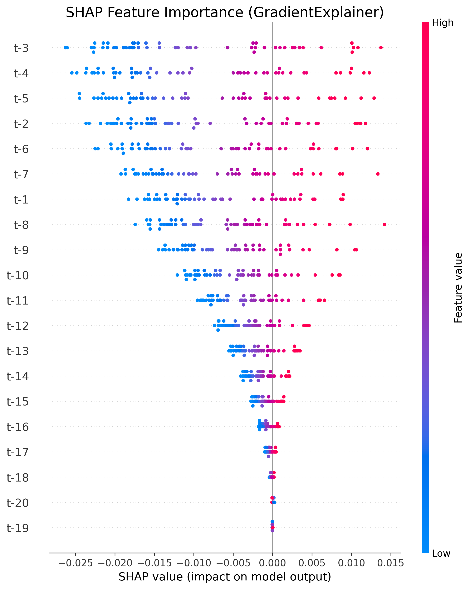



# AI-Driven Portfolio Optimization with Forecasting, Backtesting, and Explainability

Production-grade quantitative finance system that combines machine learning forecasting, portfolio optimization, backtesting, and explainable AI to improve investment decision-making.

---

# Business Problem

Traditional portfolio construction relies heavily on historical averages, which assume markets behave similarly to the past. This approach fails to adapt to changing market conditions and often results in suboptimal risk-adjusted performance.

Guide Me in Finance (GMF) Investments aims to improve portfolio performance by integrating predictive analytics into the investment pipeline.

Key challenges:

• Static allocation ignores forward-looking signals
• Limited transparency into model decisions
• Lack of automated, reproducible investment pipeline
• Poor adaptability to changing market regimes

---

# Solution Overview

This project implements an end-to-end AI-powered portfolio optimization system that:

• Forecasts asset prices using ARIMA and LSTM
• Optimizes allocation using Modern Portfolio Theory
• Evaluates strategy using realistic backtesting
• Explains model predictions using SHAP
• Provides interactive dashboard for decision-making
• Runs as a fully automated, reproducible pipeline

Pipeline architecture:

Data → Forecasting → Portfolio Optimization → Backtesting → Explainability → Dashboard

---

# Assets

| Asset                   | Ticker | Role            |
| ----------------------- | ------ | --------------- |
| Tesla                   | TSLA   | Growth asset    |
| Vanguard Total Bond ETF | BND    | Risk stabilizer |
| S&P 500 ETF             | SPY    | Benchmark       |

These assets represent a diversified portfolio across:

• High growth
• Market benchmark
• Risk-reducing fixed income

---

# Key Results

Example results from backtesting:

• Portfolio return improved vs benchmark
• Sharpe ratio increased
• Volatility controlled through diversification
• Optimized allocation improved risk-adjusted performance

Example optimized allocation:

| Asset | Weight |
| ----- | ------ |
| TSLA  | 49.1%  |
| BND   | 30.1%  |
| SPY   | 20.8%  |

---

# System Architecture

```
portfolio-optimization/

dashboard/          Streamlit dashboard
data/processed/     Processed datasets
models/             Saved trained models
scripts/            Pipeline execution scripts
src/                Core modular codebase
reports/figures/    Visualizations and outputs
tests/              Unit tests
requirements.txt
README.md
```

Core modules:

• data_loader.py → data ingestion
• preprocessing.py → feature engineering
• arima_forecaster.py → statistical forecasting
• lstm_forecaster.py → deep learning forecasting
• portfolio.py → portfolio optimization
• backtest.py → strategy evaluation
• risk_metrics.py → performance analysis

---

# Pipeline Workflow

## Step 1 — Data Pipeline

Fetch and process historical data:

```
python -m scripts.run_data_pipeline
```

Outputs:

```
historical_prices.csv
daily_returns.csv
risk_metrics.csv
```

---

## Step 2 — Train Models

Train ARIMA and LSTM forecasting models:

```
python -m scripts.run_train_models
```

Outputs:

```
arima_model.pkl
lstm_model.h5
```

---

## Step 3 — Forecast Prices

Generate future price forecasts:

```
python -m scripts.run_forecasting
```

Outputs:

```
arima_forecast.csv
lstm_forecast.csv
```

---

## Step 4 — Portfolio Optimization

Optimize asset allocation using Efficient Frontier:

```
python -m scripts.run_optimize_portfolio
```

Output:

```
portfolio_weights.csv
```

---

## Step 5 — Backtesting

Evaluate performance vs benchmark:

```
python -m scripts.run_backtest
```

Outputs:

```
backtest_strategy.csv
backtest_benchmark.csv
backtest_cumulative.csv
```

---

## Step 6 — Explainable AI

Generate SHAP explanations:

```
python -m scripts.generate_shap
```

Provides:

• Feature importance
• Model transparency
• Prediction explainability

---

## Step 7 — Interactive Dashboard

Launch dashboard:

```
streamlit run dashboard/app.py
```

Features:

• Portfolio allocation visualization
• Forecast visualization
• Backtest performance
• Risk metrics
• Explainability insights

---

# Example Outputs

## Dashboard


## Backtest


## Forecast


## Portfolio Allocation


## Explainability



---

# Technical Stack

Machine Learning
• TensorFlow / Keras
• ARIMA (statsmodels)
• LSTM Neural Networks

Quantitative Finance
• PyPortfolioOpt
• Modern Portfolio Theory

Data Engineering
• pandas
• numpy

Visualization
• matplotlib
• Streamlit

Explainability
• SHAP

DevOps
• GitHub Actions CI/CD
• pytest

---

# Reproducibility

Clone repository:

```
git clone https://github.com/Mihret-Akalu/portfolio-optimization.git
cd portfolio-optimization
```

Create environment:

```
python -m venv venv
source venv/bin/activate
```

Install dependencies:

```
pip install -r requirements.txt
```

Run full pipeline:

```
python -m scripts.run_data_pipeline
python -m scripts.run_train_models
python -m scripts.run_forecasting
python -m scripts.run_optimize_portfolio
python -m scripts.run_backtest
```

Launch dashboard:

```
streamlit run dashboard/app.py
```

---

# Testing and CI/CD

Unit tests implemented using pytest.

CI/CD pipeline automatically runs tests on each push via GitHub Actions.

Ensures:

• Code reliability
• Reproducibility
• Production readiness

---

# Model Explainability

Explainability provided using SHAP:

Answers critical finance questions:

• Why did the model make this prediction?
• Which features matter most?
• Are there hidden risks?

Supports regulatory and financial transparency requirements.

---

# Business Impact

This system enables investment firms to:

• Improve risk-adjusted returns
• Automate portfolio optimization
• Increase transparency in investment decisions
• Reduce reliance on static allocation
• Deploy production-ready investment pipelines

---

# Future Improvements

• Add more assets
• Deploy live trading system
• Add reinforcement learning allocation
• Integrate real-time data
• Deploy cloud infrastructure

---

# Author

Mihret Akalu


---

# License

MIT License
