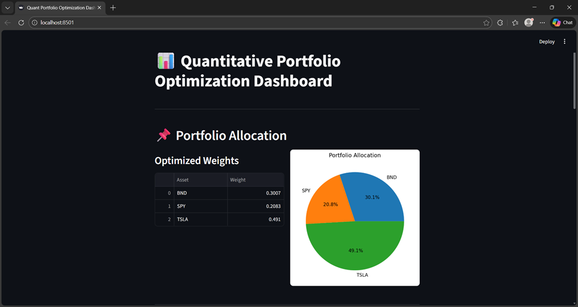
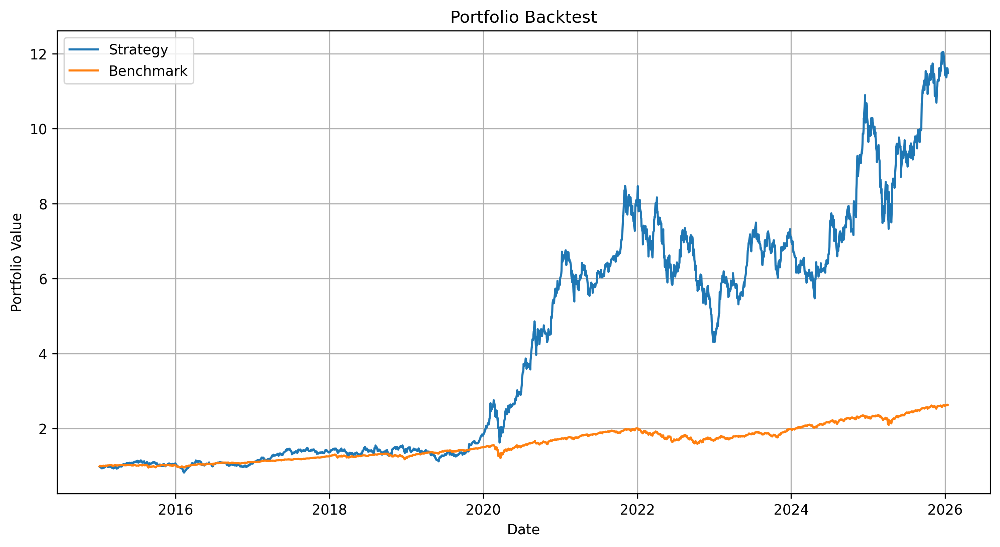
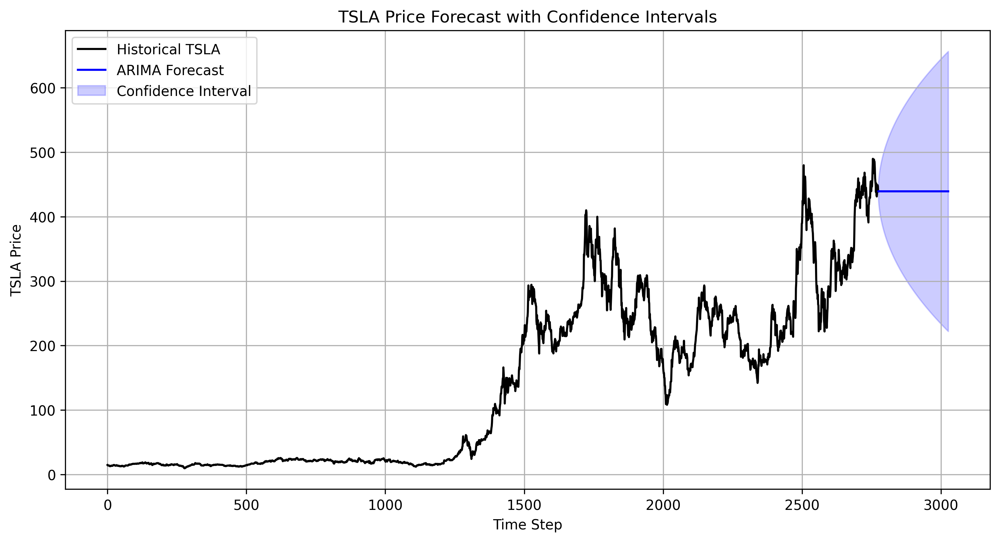
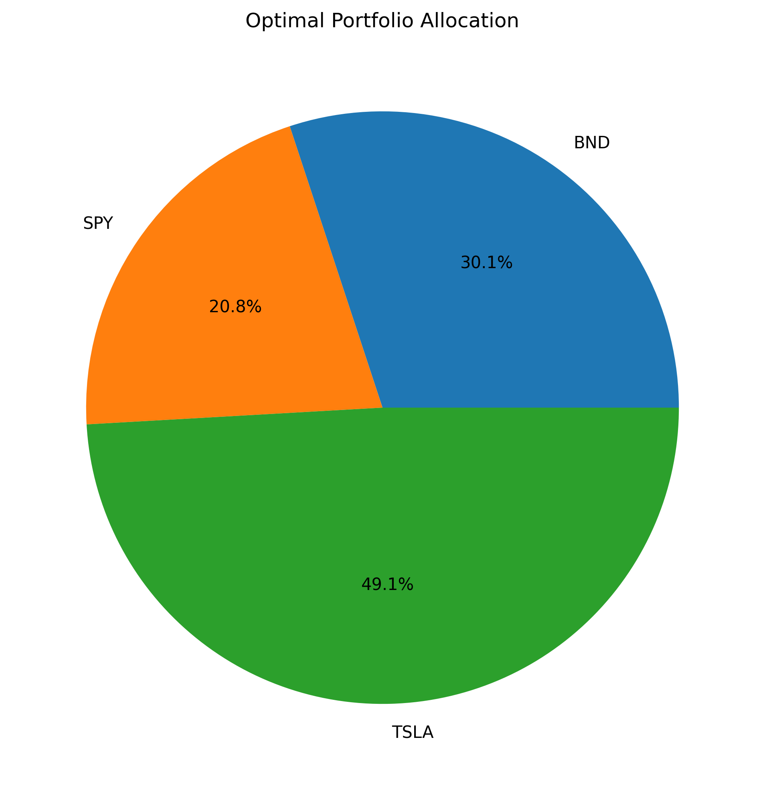



# Portfolio Optimization using Time Series Forecasting

## Overview

This project implements a complete end-to-end financial forecasting and portfolio optimization system using machine learning and quantitative finance techniques.

The system forecasts asset prices using ARIMA and LSTM models, optimizes asset allocation using Modern Portfolio Theory, and evaluates performance through realistic backtesting.

The goal is to demonstrate how predictive modeling can improve portfolio construction, risk management, and investment decision-making.

---

## Business Objective

Guide Me in Finance (GMF) Investments seeks to improve portfolio performance by integrating predictive analytics into its investment workflow.

Key objectives:

* Forecast asset price trends using time series models
* Optimize asset allocation using expected return and risk
* Improve risk-adjusted performance compared to benchmark portfolios
* Provide a production-ready, automated investment pipeline

---

## Assets Used

| Asset                   | Ticker | Role             |
| ----------------------- | ------ | ---------------- |
| Tesla                   | TSLA   | Growth asset     |
| Vanguard Total Bond ETF | BND    | Risk stabilizer  |
| S&P 500 ETF             | SPY    | Market benchmark |

---

## System Architecture

```
portfolio-optimization/
│
├── dashboard/
│   └── app.py
│
├── data/
│   └── processed/
│
├── models/
│
├── scripts/
│   ├── run_data_pipeline.py
│   ├── run_train_models.py
│   ├── run_forecasting.py
│   ├── run_optimize_portfolio.py
│   ├── run_backtest.py
│   ├── run_forecast_plot.py
│   ├── run_risk_metrics.py
│   └── run_plot_portfolio_weights.py
│   
│   
├── src/
│   ├── data_loader.py
│   ├── preprocessing.py
│   ├── arima_forecaster.py
│   ├── lstm_forecaster.py
│   ├── portfolio.py
│   ├── risk_metrics.py
│   ├── backtest.py
│   ├── train_arima.py
│   ├── train_lstm.py
│   └── evaluate.py
│
├── reports/
│   └── figures/
│
├── requirements.txt
└── README.md
```

---

## Pipeline Workflow

### Step 1: Data Pipeline

Fetch historical financial data and compute returns and risk metrics.

```bash
python -m scripts.run_data_pipeline
```

Outputs:

```
data/processed/historical_prices.csv
data/processed/daily_returns.csv
data/processed/risk_metrics.csv
```

---

### Step 2: Train Forecasting Models

Train ARIMA and LSTM models for Tesla price forecasting.

```bash
python -m scripts.run_train_models
```

Outputs:

```
models/arima_model.pkl
models/lstm_model.h5
```

---

### Step 3: Generate Forecasts

Generate future price forecasts with uncertainty intervals.

```bash
python -m scripts.run_forecasting
```

Outputs:

```
data/processed/tsla_arima_forecast_with_intervals.csv
data/processed/tsla_lstm_forecast_with_intervals.csv
```

---

### Step 4: Portfolio Optimization

Construct optimal portfolio using Efficient Frontier optimization.

```bash
python -m scripts.run_optimize_portfolio
```

Outputs:

```
data/processed/portfolio_weights.csv
```

Example allocation:

| Asset | Weight |
| ----- | ------ |
| TSLA  | 49.1%  |
| BND   | 30.1%  |
| SPY   | 20.8%  |

---

### Step 5: Backtesting

Evaluate performance of optimized portfolio vs benchmark.

```bash
python -m scripts.run_backtest
```

Outputs:

```
data/processed/backtest_cumulative.csv
reports/figures/backtest_cumulative.png
```

---

### Step 6: Interactive Dashboard

Launch Streamlit dashboard:

```bash
streamlit run dashboard/app.py
```

Displays:

* Portfolio allocation
* Forecast results
* Backtest performance
* Risk metrics

---

## Results

### Dashboard



---

### Backtest Performance



---

### Forecast Example



---

### Portfolio Allocation



---

## Performance Metrics

Example strategy performance:

* Higher return than benchmark portfolio
* Improved Sharpe ratio
* Controlled volatility
* Diversified allocation

---

## Technologies Used

* Python
* pandas
* numpy
* matplotlib
* statsmodels
* tensorflow / keras
* PyPortfolioOpt
* Streamlit

---

## Key Features

* End-to-end automated pipeline
* Machine learning forecasting (ARIMA, LSTM)
* Portfolio optimization using Efficient Frontier
* Risk metrics and performance evaluation
* Strategy backtesting vs benchmark
* Interactive dashboard visualization
* Modular production-ready architecture

---

## Installation

Clone repository:

```bash
git clone https://github.com/Mihret-Akalu/portfolio-optimization.git
cd portfolio-optimization
```

Create virtual environment:

```bash
python -m venv venv
source venv/bin/activate
```

Install dependencies:

```bash
pip install -r requirements.txt
```

---

## How to Run Full Pipeline

```bash
python -m scripts.run_data_pipeline
python -m scripts.run_train_models
python -m scripts.run_forecasting
python -m scripts.run_optimize_portfolio
python -m scripts.run_backtest
```

---

## Project Highlights

This project demonstrates:

* Time series forecasting
* Machine learning in finance
* Portfolio optimization
* Risk modeling
* Backtesting methodology
* Production-level project structure

---

## Author

Mihret Akalu

---

## License

MIT License

---
